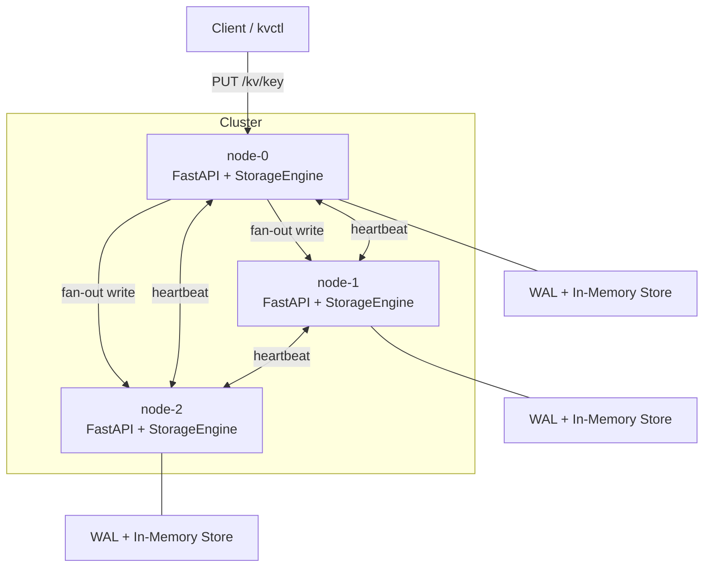
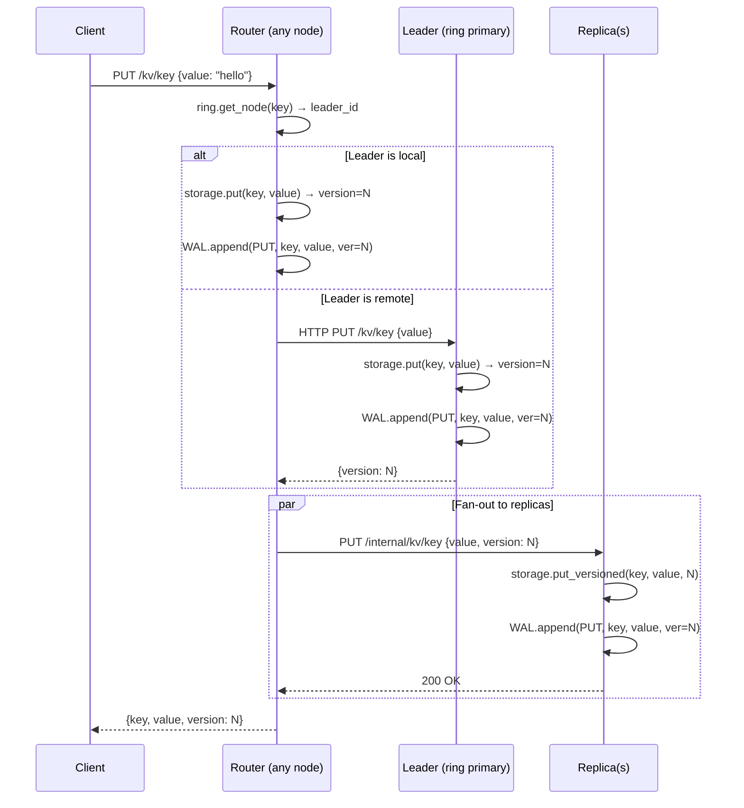
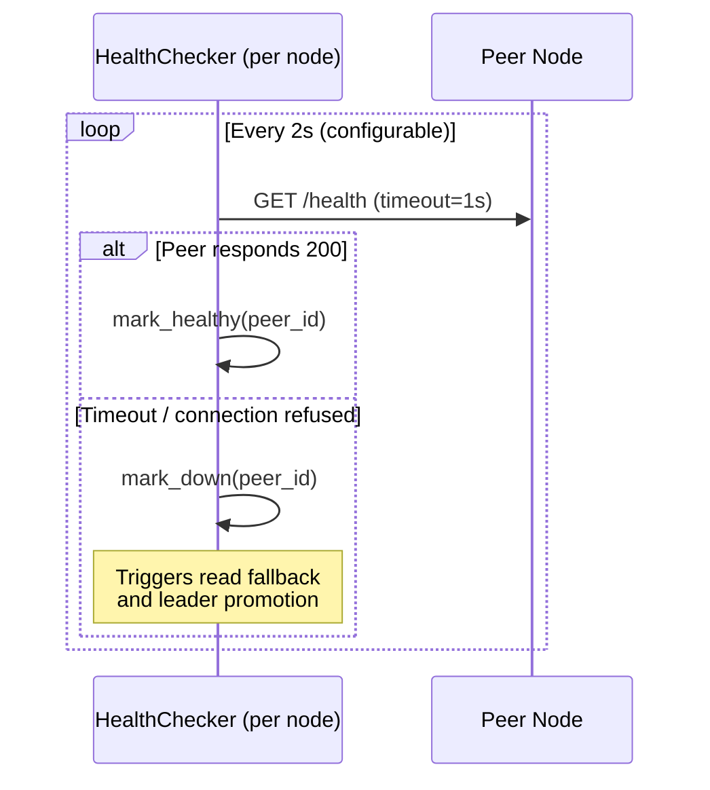
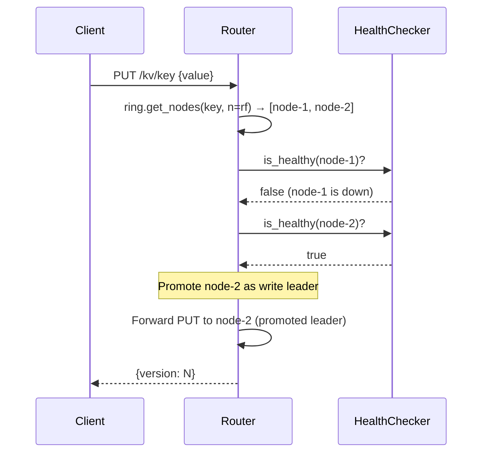
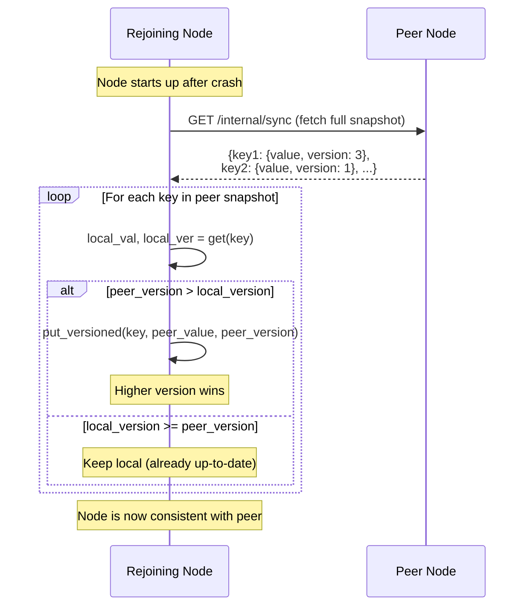
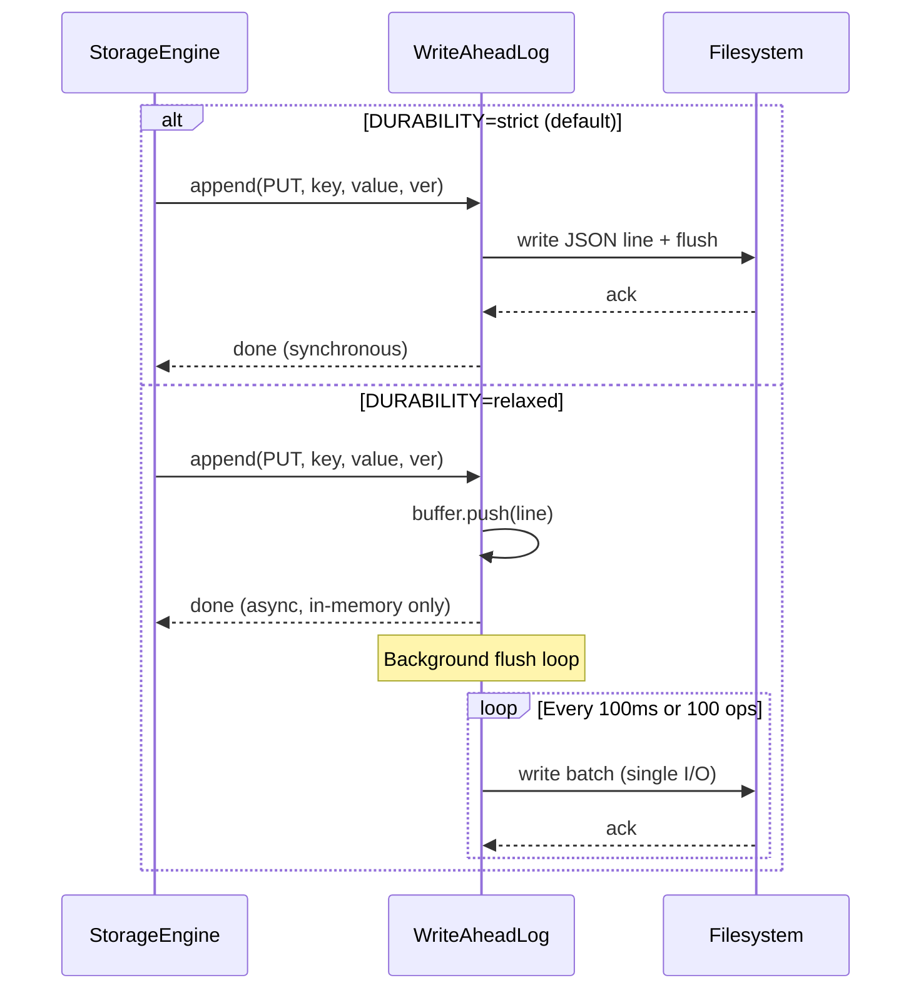
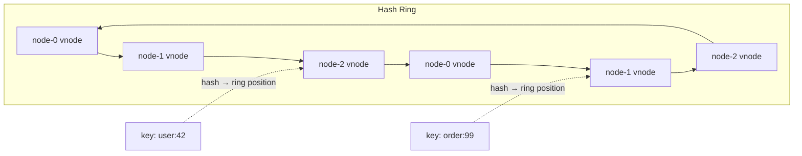

# Distributed KV Store — System Design

> Architecture reference with sequence diagrams for every critical path.

## High-Level Architecture



## Data Model

```
Key: string (e.g., "user:123")
Value: string
Version: monotonic integer per key (starts at 1, increments each PUT)
```

Each node stores: `{key → {value: str, version: int}}`

---

## 1. Versioned Write Path (PUT)

Single-leader write coordination with version tracking:



### Why single-leader?
- Version counter is authoritative on the leader — no conflicts
- Replicas receive the exact version, ensuring consistency
- Trade-off: leader is a bottleneck per key, but keys are sharded across nodes

---

## 2. Read Path (GET) with Replica Fallback

```mermaid
sequenceDiagram
    participant C as Client
    participant R as Router (any node)
    participant P as Primary
    participant Rep as Replica

    C->>R: GET /kv/key
    R->>R: ring.get_nodes(key, n=rf) → [primary, replica]
    
    alt Primary is healthy
        alt Primary is local
            R->>R: storage.get(key) → (value, version)
        else Primary is remote
            R->>P: HTTP GET /kv/key
            P-->>R: {value, version}
        end
    else Primary is down (health checker)
        R->>R: Skip primary, try next healthy node
        R->>Rep: HTTP GET /kv/key
        Rep-->>R: {value, version}
    end
    
    R-->>C: {key, value, version}
```



### Consistency note
Reads from replicas may return stale data (eventual consistency). The version field lets clients detect staleness.

---

## 3. Failure Detection (Heartbeat)



---

## 4. Leader Promotion (Write Failover)



### Trade-off
Leader promotion means the promoted node assigns a **new** version counter. If the original leader comes back, its version may conflict. We resolve this during sync-on-rejoin (higher version wins).

---

## 5. Sync-on-Rejoin (Anti-Entropy)



---

## 6. WAL Durability Modes



| Mode | Throughput | Data loss window |
|------|-----------|-----------------|
| strict | ~8K PUT/s | 0 |
| relaxed | ~50K+ PUT/s | ≤100ms |

---

## 7. Consistent Hashing (Key Routing)



- **150 virtual nodes** per physical node (configurable)
- SHA-256 hash for uniform distribution
- Adding/removing a node moves only ~1/N of keys

---

## ADR Index

| ADR | Decision | Trade-off |
|-----|----------|-----------|
| [001](docs/decisions/001-ap-over-cp.md) | AP over CP | Availability over strict consistency |
| [002](docs/decisions/002-consistent-hashing.md) | Consistent hashing | Uniform distribution vs ring complexity |
| [003](docs/decisions/003-wal-json-lines.md) | JSON-lines WAL | Human-readable vs binary efficiency |
| [004](docs/decisions/004-synchronous-replication.md) | Synchronous replication | Consistency vs write latency |
| [005](docs/decisions/005-single-leader-writes.md) | Single-leader writes | Simplicity vs multi-master throughput |
| [006](docs/decisions/006-batched-wal-durability.md) | Batched WAL | Throughput vs bounded data loss |
