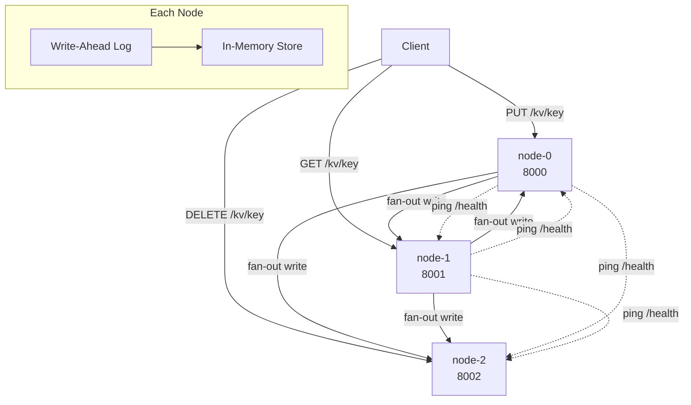

# Distributed Key-Value Store

A fault-tolerant, distributed in-memory key-value store built in Python. Designed to demonstrate core distributed systems concepts: consistent hashing, synchronous replication, automatic leader failover, and crash recovery — all without external dependencies like etcd or ZooKeeper.

---

## Architecture



**Request flow:**
1. Any client request hits any node
2. `ClusterRouter` hashes the key → identifies owner (primary) via the consistent hash ring
3. **Reads:** try primary → if down, try replicas in ring order
4. **Writes:** find first healthy node (write-leader) → fan-out to all live replicas in parallel

---

## Features

### Consistent Hashing with Virtual Nodes
Keys are distributed across nodes using SHA-256 hashed positions on a sorted ring. Each physical node occupies 150 virtual positions so the key distribution is roughly equal. Adding a new node moves only `~1/N` of existing keys — minimising rebalancing cost.

### Synchronous Replication (`REPLICATION_FACTOR=N`)
Every write is fanned out to `N` nodes in parallel using `asyncio.gather`. The client gets a success response only after all live replicas confirm. Nodes that are down at write time catch up via sync-on-rejoin.

### Automatic Leader Failover (Write Path)
The write-leader for each key is the **first healthy node** in that key's replication set. When the ring-primary goes down, the router automatically promotes the first live replica as the new write target — no manual intervention needed.

### Heartbeat-Based Failure Detection
Each node runs a `HealthChecker` background task that pings all peers' `/health` endpoint every 5 seconds. The router also marks a node down immediately on any network error without waiting for the next tick.

### Replica Read Fallback (Read Path)
GET requests iterate the full replication set in order. If the primary is down it falls back to the next healthy replica. Only returns 503 when *every* copy is unreachable.

### Write-Ahead Log (WAL) Durability
Every mutation is appended to a per-node WAL file before being applied to memory. On restart, the WAL is replayed to restore state. This survives process crashes with no data loss.

### Sync-on-Rejoin (Anti-Entropy)
When a node restarts after a crash it calls `GET /internal/sync` on a live peer before accepting traffic, pulling any keys it missed while it was down.

---

## CAP Theorem Trade-offs

This system makes an explicit **AP (Availability + Partition Tolerance)** choice:

| Situation | Behaviour |
|-----------|-----------|
| Primary down, replica alive | Reads served from replica (may be slightly stale) |
| Primary down, replica alive | Writes routed to replica (leader promotion) |
| All replicas down | Returns 503 |
| Node rejoins after crash | Syncs missing keys from peer, then serves traffic |

**Split-brain window:** Two nodes may briefly disagree on leader identity if their HealthChecker views diverge. This window is at most one check interval (~5 s). Raft would eliminate this window but adds significant complexity. The decision to not implement Raft is intentional and documented here.

**Stale reads:** A replica that missed writes while its primary was up may serve stale data. Vector clocks per key would resolve this — deferred as a known limitation.

---

## API

| Method | Path | Description |
|--------|------|-------------|
| `GET` | `/health` | Node health + local key count |
| `GET` | `/kv/{key}` | Get value (with replica fallback) |
| `PUT` | `/kv/{key}` | Store value (fan-out to rf nodes) |
| `DELETE` | `/kv/{key}` | Delete value (fan-out to rf nodes) |
| `GET` | `/cluster/health` | Aggregated cluster health from local HealthChecker |
| `GET` | `/stats` | Node stats + peer health snapshot |
| `GET` | `/internal/sync` | Full local snapshot (for sync-on-rejoin) |

---

## Running Locally

**Requirements:** Docker, Docker Compose

```bash
git clone https://github.com/Ajayvardhanreddy/distributed-kv-store.git
cd distributed-kv-store
docker-compose up --build
```

This starts a 3-node cluster on ports 8000, 8001, 8002.

```bash
# Write a key (replicated to 2 nodes)
curl -X PUT http://localhost:8000/kv/user:1 \
  -H "Content-Type: application/json" \
  -d '{"key": "user:1", "value": "alice"}'

# Read from any node
curl http://localhost:8001/kv/user:1

# Check cluster health
curl http://localhost:8000/cluster/health | python3 -m json.tool

# Simulate a failure: kill node-0 and still read from node-1
docker stop distributed-kv-store-node-0-1
curl http://localhost:8001/kv/user:1   # still works via replica!
```

---

## Running Tests

```bash
python -m venv .venv && source .venv/bin/activate
pip install -r requirements.txt
PYTHONPATH=. pytest tests/unit/ tests/test_api.py -v      # unit + API tests (fast, ~1s)
PYTHONPATH=. pytest tests/integration/test_chaos.py -v    # chaos tests (real servers, ~20s)
PYTHONPATH=. pytest -v                                     # everything
```

### Test coverage by file

| File | What it tests |
|------|--------------|
| `test_storage.py` | StorageEngine CRUD, concurrency |
| `test_wal.py` | WAL append/replay, corruption handling |
| `test_consistent_hash.py` | Ring distribution, minimal rebalancing |
| `test_cluster_router.py` | Forwarding, unreachable peer handling |
| `test_replication.py` | get_nodes(), fan-out writes, replica failure |
| `test_health_checker.py` | Mark-down, background loop recovery, read fallback |
| `test_leader_promotion.py` | Write-leader selection, all-down 503, snapshot() |
| `test_chaos.py` | Real in-process servers: crash/recover/sync scenarios |

---

## Configuration

| Env Var | Default | Description |
|---------|---------|-------------|
| `NODE_ID` | — | Unique node identifier (e.g. `node-0`) |
| `NODE_PORT` | `8000` | Port to listen on |
| `PEERS` | — | Comma-separated URLs of ALL nodes including self |
| `REPLICATION_FACTOR` | `2` | How many nodes store each key |
| `DATA_DIR` | `data` | Directory for WAL files |

---

## Project Structure

```
distributed-kv-store/
├── app/
│   ├── cluster/
│   │   ├── consistent_hash.py   # Hash ring + virtual nodes
│   │   ├── health_checker.py    # Background failure detection
│   │   ├── node_config.py       # Env-var config
│   │   └── router.py            # ClusterRouter: reads, writes, failover
│   ├── storage/
│   │   ├── engine.py            # StorageEngine (in-memory + WAL)
│   │   └── wal.py               # Write-Ahead Log
│   └── main.py                  # FastAPI app + lifespan + endpoints
├── tests/
│   ├── unit/                    # Fast isolated tests (~1s total)
│   └── integration/
│       └── test_chaos.py        # Fault-injection with real servers
├── docker-compose.yml           # 3-node cluster
├── Dockerfile
└── requirements.txt
```

---

## Phase Roadmap

| Phase | Feature | Status |
|-------|---------|--------|
| 0 | Project setup, Docker, CI | ✅ |
| 1 | Single-node core + WAL durability | ✅ |
| 2 | Consistent hashing + virtual nodes | ✅ |
| 3 | Multi-node cluster + HTTP forwarding | ✅ |
| 4 | Synchronous replication (write fan-out) | ✅ |
| 5 | Heartbeat failure detection + replica reads | ✅ |
| 6 | Leader promotion + sync-on-rejoin + chaos tests | ✅ |
