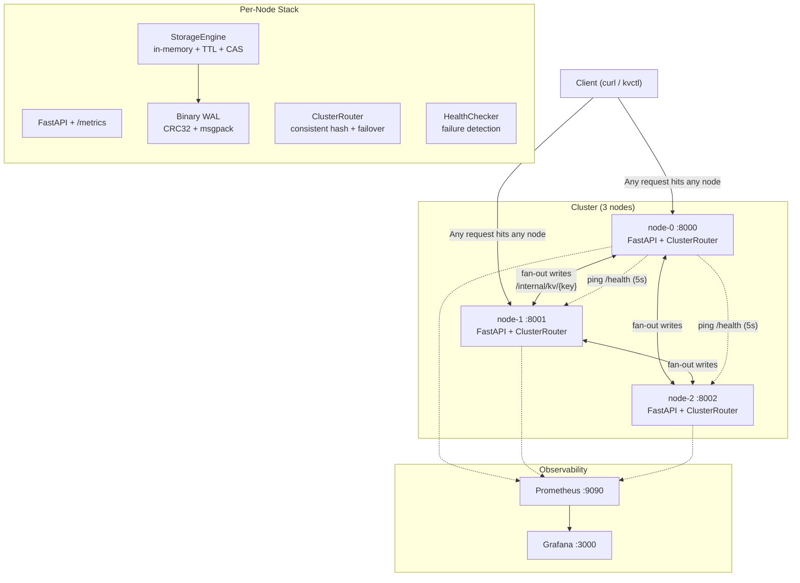

# Distributed KV Store

   

A fault-tolerant, distributed in-memory key-value store built from scratch in Python — no etcd, no ZooKeeper, no external consensus library. Implements consistent hashing, synchronous replication, automatic leader failover, binary WAL durability, tombstone deletes, TTL expiry, and compare-and-swap — validated with 12 real-server chaos tests.

> **[System Design →](DESIGN.md)** · **[Architecture Decisions →](docs/decisions/)**

---

**Part of a 3-layer AI infrastructure portfolio.** This is **Layer 1** — the storage foundation that powers the full agent stack above it.

| Layer | Repo | What it does |
|-------|------|--------------|
| **Layer 1 — this repo** | [distributed-kv-store](https://github.com/Ajayvardhanreddy/distributed-kv-store) | Fault-tolerant distributed KV storage with consistent hashing and node failover |
| Layer 2 | [agent-memory-service](https://github.com/Ajayvardhanreddy/agent-memory-service) | Multi-namespace memory service (session, user, working, audit) backed by Layer 1 |
| Layer 3 | [agent-execution-engine](https://github.com/Ajayvardhanreddy/agent-execution-engine) | Agent runtime — orchestration, tool execution, memory, observability, evals, MCP |

---

## What's Built

| | Feature | Detail |
|---|---|---|
| 🔁 | **Consistent Hashing** | SHA-256, 150 virtual nodes/physical node — 2.8× fewer keys moved vs modulo on scale-out |
| 📋 | **Synchronous Replication** | Configurable replication factor, fan-out via `asyncio.gather`, write only ACK'd after all live replicas confirm |
| ⚡ | **Automatic Leader Failover** | First healthy node in ring order becomes write-leader; promotion is instant, no voting required |
| 💾 | **Binary WAL** | CRC32-framed msgpack records, strict/relaxed durability modes, crash-safe replay, auto-migration from legacy JSON format |
| 🪦 | **Tombstone Deletes** | Deletes write a versioned tombstone instead of physical removal; tombstones propagate during anti-entropy sync to prevent key resurrection on node rejoin |
| ⏱️ | **Per-Key TTL** | Lazy expiry on reads (zero latency cost) + active background sweeper (probabilistic, Redis-style) with tombstone fan-out to all replicas |
| 🔒 | **Compare-and-Swap** | Conditional writes with opaque version tokens (`if_match` / `if_none_match`); 409 on conflict with current token |
| 🔄 | **Anti-Entropy Sync** | Rejoining node pulls full snapshot from a live peer; version comparison + tombstone awareness prevents stale data from winning |
| 💓 | **Failure Detection** | `HealthChecker` pings all peers every 5s; router marks a node down immediately on any network error |
| 📊 | **Observability** | Prometheus metrics on every node + provisioned Grafana dashboard, zero config |

---

## Architecture



**Request flow:**
1. Client hits any node — all nodes are equal, no gateway required
2. `ClusterRouter` hashes the key → identifies primary + replicas via the consistent hash ring
3. **Read:** try primary → if down, try each replica in ring order
4. **Write:** route to write-leader (first healthy node in replication set) → fan-out to all live replicas in parallel via `asyncio.gather`

---

## Quick Start

**Requires:** Docker, Docker Compose

```bash
git clone https://github.com/Ajayvardhanreddy/distributed-kv-store.git
cd distributed-kv-store
docker compose up --build -d && docker image prune -f
```

This starts **3 KV nodes** (ports 8000–8002) + Prometheus (9090) + Grafana (3000).

```bash
# Write a key — replicated to 2 nodes automatically
curl -X PUT http://localhost:8000/kv/user:1 \
  -H "Content-Type: application/json" \
  -d '{"key": "user:1", "value": "alice"}'
# → {"message":"success","key":"user:1","version_token":"1"}

# Read from any node (replica fallback built-in)
curl http://localhost:8001/kv/user:1
# → {"value":"alice","version_token":"1"}

# Conditional write (CAS) — only succeeds if version matches
curl -X PUT http://localhost:8000/kv/user:1 \
  -H "Content-Type: application/json" \
  -d '{"key": "user:1", "value": "bob", "if_match": "1"}'
# → {"message":"success","key":"user:1","version_token":"2"}

# Write with TTL (key auto-expires in 60 seconds)
curl -X PUT http://localhost:8000/kv/session:abc \
  -H "Content-Type: application/json" \
  -d '{"key": "session:abc", "value": "data", "ttl_seconds": 60}'

# Kill node-0 — reads still work via replica
docker stop distributed-kv-store-node-0-1
curl http://localhost:8001/kv/user:1   # still returns alice

# Write with node-0 down — leader promotion kicks in
curl -X PUT http://localhost:8001/kv/order:1 \
  -H "Content-Type: application/json" \
  -d '{"key": "order:1", "value": "pending"}'

# Check cluster health
curl http://localhost:8001/cluster/health | python3 -m json.tool
```

---

## API Reference

| Method | Path | Description |
|--------|------|-------------|
| `GET` | `/health` | Node health + local key count |
| `GET` | `/kv/{key}` | Get value with replica fallback; returns `value` + `version_token` |
| `PUT` | `/kv/{key}` | Write value; optional `if_match`, `if_none_match`, `ttl_seconds` |
| `DELETE` | `/kv/{key}` | Write tombstone; optional `if_match` for conditional delete |
| `GET` | `/cluster/health` | Health status of all nodes |
| `GET` | `/stats` | Node stats + peer health snapshot |
| `GET` | `/metrics` | Prometheus metrics |
| `GET` | `/internal/sync` | Full local snapshot including tombstones (used by anti-entropy) |

### CAS (Compare-and-Swap)

```bash
# Step 1: read the token
TOKEN=$(curl -s http://localhost:8000/kv/counter | jq -r .version_token)

# Step 2: conditional write — only applies if nobody else wrote in between
curl -X PUT http://localhost:8000/kv/counter \
  -H "Content-Type: application/json" \
  -d "{\"key\": \"counter\", \"value\": \"2\", \"if_match\": \"$TOKEN\"}"
# Conflict → 409 {"message":"version mismatch","current_token":"3"}

# Create-if-absent (atomic, prevents overwriting existing keys)
curl -X PUT http://localhost:8000/kv/lock:job-1 \
  -H "Content-Type: application/json" \
  -d '{"key": "lock:job-1", "value": "worker-A", "if_none_match": true}'
```

---

## Benchmarks

### Storage Engine (in-process, no network)

Direct calls to `StorageEngine` — measures raw data structure speed, not HTTP throughput. 10,000 operations per run.

| Operation | ops/sec | Latency p50 | Notes |
|-----------|---------|-------------|-------|
| **GET** | ~2,500,000 | 0.4 µs | In-memory dict lookup + asyncio lock |
| **Ring Lookup** | ~1,273,000 | — | SHA-256 + bisect on sorted ring |
| **PUT** | ~8,000 | 116 µs | WAL append to disk (strict mode) |
| **DELETE** | ~8,000 | — | WAL tombstone append to disk |

> These numbers measure the storage engine directly. They do **not** include HTTP parsing, JSON serialization, or network round-trips.

```bash
PYTHONPATH=. python benchmarks/benchmark_throughput.py
```

### HTTP Cluster (real load test, measured with Apache Bench)

End-to-end GET requests through FastAPI → ClusterRouter → StorageEngine → response.

| Config | req/sec | p50 | p95 | p99 |
|--------|---------|-----|-----|-----|
| 1 uvicorn worker, c=50 | ~1,100 | 41 ms | 76 ms | 104 ms |
| 4 uvicorn workers, c=50 | ~2,400 | 8 ms | 26 ms | 116 ms |

```bash
# Reproduce (requires apache bench)
ab -n 20000 -c 50 http://localhost:8000/kv/bench-key
```

**Why the gap?** Each HTTP GET traverses: Docker NAT → uvicorn → FastAPI route → asyncio.Lock → dict lookup → JSON encode → response. The storage engine benchmark skips all of that.

### Key Distribution

100,000 keys across 3 nodes, 150 virtual nodes each:

| Node | Keys | Variance |
|------|------|----------|
| node-0 | 35,580 | +6.74% |
| node-1 | 30,865 | −7.41% |
| node-2 | 33,555 | −0.66% |

### Rebalance Impact (3 → 4 nodes)

| Method | Keys moved | Theoretical minimum |
|--------|-----------|-------------------|
| **Consistent hashing** | 26.7% | 25.0% |
| **Modulo hashing** | 75.1% | — |

**2.8× fewer keys moved** with consistent hashing. See [ADR-001](docs/decisions/001-consistent-hashing-over-modulo.md).

---

## Tests

```bash
uv sync --group dev

# Fast unit tests (~1s)
uv run pytest tests/unit/ tests/test_api.py -v

# Chaos tests — real in-process servers, real failure scenarios (~25s)
uv run pytest tests/integration/test_chaos.py -v

# Full suite (94 tests)
uv run pytest
```

### Coverage by area

| File | What it covers | Tests |
|------|---------------|-------|
| `test_storage.py` | StorageEngine CRUD, TTL, concurrent access | 8 |
| `test_wal.py` | Binary format, CRC32, replay, JSON migration | 14 |
| `test_consistent_hash.py` | Ring distribution, minimal rebalancing | 8 |
| `test_cluster_router.py` | Forwarding, unreachable peer handling | 8 |
| `test_replication.py` | Fan-out writes, replica failure, get_nodes() | 14 |
| `test_health_checker.py` | Mark-down, background loop, read fallback | 11 |
| `test_leader_promotion.py` | Write-leader selection, all-down 503 | 9 |
| `test_versioning.py` | Version counters, WAL replay, sync merge | 11 |
| `test_tombstones.py` | Tombstone writes, compaction, resurrection prevention | — |
| `test_ttl.py` | Lazy expiry, active sweeper, replica fan-out | — |
| `test_cas.py` | if_match, if_none_match, 409 conflict | — |
| `test_chaos.py` | **12 real-server fault injection scenarios** | 12 |
| `test_api.py` | FastAPI endpoint integration | 5 |

### Chaos scenarios (real in-process uvicorn servers, not mocks)

1. Read survives primary crash — replica fallback
2. Write fails over to replica — leader promotion
3. `/cluster/health` reflects crashed node after detection interval
4. Rejoined node syncs missing keys — anti-entropy
5. Concurrent writes produce valid monotonic versions
6. WAL replay after crash preserves exact versions
7. Split-brain detection via version comparison
8. Rapid sequential failover (kill two nodes, cluster stays up)
9. Full cluster restart — all 3 nodes stop and restart, data intact
10. Write during rejoin — concurrent sync + write
11. Relaxed durability — graceful shutdown preserves all writes
12. Large batch (50 keys) + crash recovery via WAL

---

## Design Decisions

Each major choice is documented with context, alternatives considered, and trade-offs:

| # | Decision | Core trade-off |
|---|----------|---------------|
| [001](docs/decisions/001-consistent-hashing-over-modulo.md) | Consistent hashing over modulo | 2.8× fewer keys moved on scale-out |
| [002](docs/decisions/002-synchronous-vs-async-replication.md) | Synchronous replication | No data-loss window vs higher write latency |
| [003](docs/decisions/003-why-not-raft.md) | Ring-based leader election, not Raft | Instant failover vs ~5s split-brain window |
| [004](docs/decisions/004-ap-over-cp.md) | AP over CP | Always available vs linearizable (like DynamoDB) |
| [005](docs/decisions/005-wal-before-memory.md) | WAL before memory | Crash safety — no silent data loss |
| [006](docs/decisions/006-batched-wal-durability.md) | Strict vs relaxed durability | 0 data loss vs ~5–10× PUT throughput |
| [007](docs/decisions/007-binary-wal-crc.md) | Binary WAL with CRC32 + msgpack | Integrity + schema versioning vs human-readable |
| [008](docs/decisions/008-tombstone-delete-model.md) | Tombstone deletes | Prevents key resurrection vs unbounded store growth |
| [009](docs/decisions/009-ttl-expiration.md) | Lazy expiry + active sweeper | Read-path free of side-effects vs expiry lag |
| [010](docs/decisions/010-cas-conditional-writes.md) | CAS with opaque version tokens | Optimistic locking vs not linearizable under split-brain |

---

## CAP Theorem Position

This system makes an explicit **AP** choice — availability and partition tolerance over strict consistency:

| Scenario | Behaviour |
|----------|-----------|
| Primary down, replica alive | Reads served from replica (may be slightly stale) |
| Primary down, write arrives | Promoted replica becomes write-leader immediately |
| All replicas down | Returns 503 |
| Node rejoins after crash | Syncs from a live peer; higher version wins; tombstones prevent resurrection |
| Split-brain window | ~5s where two nodes may accept writes to the same key; resolved on convergence |

See [ADR-003](docs/decisions/003-why-not-raft.md) and [ADR-004](docs/decisions/004-ap-over-cp.md).

---

## Observability

Prometheus + Grafana ship out of the box — no configuration required.

```bash
# Grafana dashboard: http://localhost:3000  (admin / admin)
# Prometheus:        http://localhost:9090
# Raw metrics:       http://localhost:8000/metrics
```

**Metrics tracked:**

| Metric | Type | What it measures |
|--------|------|-----------------|
| `http_requests_total` | Counter | Request rate by endpoint and status code |
| `http_request_duration_seconds` | Histogram | Latency percentiles (p50, p95, p99) |
| `cas_conflicts_total` | Counter | CAS failures (if_match / if_none_match rejected) |
| `keys_expired_total` | Counter | Keys tombstoned by the active TTL sweeper |
| `sweeper_runs_total` | Counter | Active sweeper iterations |
| `wal_corrupt_records_total` | Counter | WAL records skipped due to CRC mismatch |
| `wal_replay_records_total` | Counter | Records successfully applied during WAL replay |

---

## Configuration

| Variable | Default | Description |
|----------|---------|-------------|
| `NODE_ID` | — | Unique node identifier (`node-0`, `node-1`, …) |
| `NODE_PORT` | `8000` | Port to listen on |
| `PEERS` | — | Comma-separated URLs of **all** nodes including self |
| `REPLICATION_FACTOR` | `2` | How many nodes store each key |
| `DATA_DIR` | `data` | Directory for WAL files |
| `DURABILITY` | `strict` | `strict` (fsync per write) or `relaxed` (batch every 100ms) |
| `HEALTH_CHECK_INTERVAL` | `5.0` | Seconds between peer health pings |
| `TOMBSTONE_RETENTION_SECONDS` | `86400` | How long tombstones persist before compaction |

---

## Project Structure

```
distributed-kv-store/
├── app/
│   ├── cluster/
│   │   ├── consistent_hash.py   # Ring + virtual nodes + get_nodes(key, n)
│   │   ├── health_checker.py    # Background ping loop + immediate mark-down
│   │   ├── node_config.py       # Env-var config parsing
│   │   └── router.py            # ClusterRouter: reads, writes, CAS, failover
│   ├── storage/
│   │   ├── engine.py            # StorageEngine: CRUD, TTL, tombstones, CAS
│   │   ├── version_token.py     # Opaque CAS token encode/decode
│   │   └── wal.py               # Binary WAL: CRC32 + msgpack + replay
│   └── main.py                  # FastAPI app, lifespan, all endpoints
├── benchmarks/
│   ├── benchmark_throughput.py  # In-process storage engine microbenchmark
│   ├── benchmark_distribution.py# Key distribution + rebalance impact
│   └── results/                 # Generated PNG graphs
├── docs/
│   └── decisions/               # ADR-001 through ADR-010
├── monitoring/
│   ├── prometheus.yml           # Scrape config
│   └── grafana/                 # Provisioned dashboard + datasource
├── tests/
│   ├── unit/                    # Fast isolated tests
│   └── integration/
│       └── test_chaos.py        # 12 fault-injection scenarios, real servers
├── docker-compose.yml           # 3 KV nodes + Prometheus + Grafana
├── Dockerfile
├── DESIGN.md                    # Sequence diagrams for every critical path
├── pyproject.toml
└── uv.lock
```

---

## Known Limitations

This project demonstrates distributed systems concepts. Production gaps are intentional scope boundaries — each one maps to a known solution:

| Limitation | What production systems do |
|-----------|---------------------------|
| **No consensus (Raft/Paxos)** — ~5s split-brain window where two nodes may both accept writes | etcd/CockroachDB use Raft; every write is committed only after a majority log it |
| **CAS is not linearizable under split-brain** — two isolated nodes can each accept a CAS | Quorum reads + Raft leader lease eliminate this |
| **No read-your-writes guarantee** — write to node-0, immediately read from node-1 may return stale | Sticky sessions, read-after-write tokens, or quorum reads (R + W > N) |
| **Full snapshot anti-entropy** — rejoining node downloads entire keyspace | Merkle tree checksums (DynamoDB) or incremental log sync (Kafka) |
| **In-memory only** — all data must fit in RAM | LSM trees (RocksDB), B-trees (SQLite), memory-mapped files |
| **Single asyncio event loop per worker** — Python GIL limits vertical scaling | Go/Rust with thread-per-core; or multiprocessing with separate WAL per worker |
| **No authentication** — any client can read/write any key | mTLS between nodes, API keys or RBAC for clients |
| **No range scans** — key lookup only, no prefix or range queries | Sorted storage (skip list / B-tree) + range partitioning instead of hash partitioning |
| **Direct HTTP health pings** — O(N²) traffic at large cluster sizes | SWIM gossip protocol (O(N) per round); used by Cassandra, Consul, Serf |

---

## What's Next (v2)

Planned improvements for the next version:

- **Raft consensus** — replace ring-based leader election with proper Raft so leader identity is globally agreed upon and the split-brain window is eliminated
- **gRPC internal transport** — swap HTTP/JSON fan-out between nodes for gRPC + protobuf; smaller payloads, HTTP/2 multiplexing, strongly typed contracts
- **LSM tree storage engine** — replace the in-memory dict with a MemTable → SSTable pipeline so the store can hold more data than fits in RAM, with bloom filters for fast miss detection
- **Gossip-based failure detection** — replace O(N²) direct health pings with a SWIM gossip protocol so failure detection traffic scales with cluster size
- **Quorum reads and writes** — expose a `?consistency=ONE|QUORUM|ALL` parameter so clients can trade latency for stronger consistency guarantees per request
- **WAL snapshots** — periodically checkpoint the full store state to disk and truncate the WAL so startup replay time doesn't grow with write history
- **nginx load balancer** — add an nginx reverse proxy in front of the cluster so clients have a single entry point with upstream health-check-based routing
- **Range scan support** — add prefix and range queries (`GET /kv?prefix=user:`) backed by a sorted data structure instead of a hash map
- **OpenTelemetry tracing** — instrument cross-node request paths so individual requests can be traced through leader selection, fan-out, and replica writes in Jaeger
