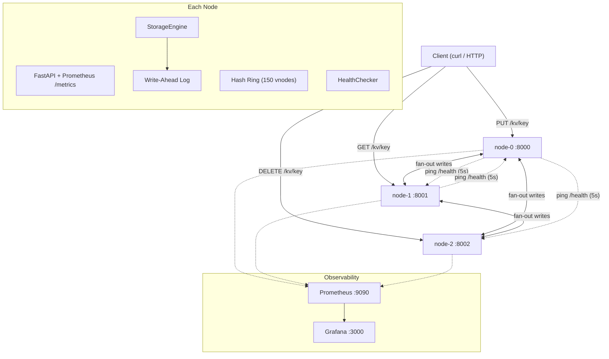

# Distributed Key-Value Store

A fault-tolerant, distributed in-memory key-value store built from scratch in Python. Demonstrates core distributed systems concepts: consistent hashing, synchronous replication, automatic leader failover, write-ahead logging, per-key versioning, and crash recovery — all without external dependencies like etcd or ZooKeeper.

> **[System Design Reference →](DESIGN.md)** — Sequence diagrams for every critical path

---

## Architecture



**Request flow:**
1. Any client request hits any node
2. `ClusterRouter` hashes the key → identifies the replication set via the consistent hash ring
3. **Reads:** try primary → if down, try replicas in ring order (replica fallback)
4. **Writes:** find first healthy node (write-leader) → fan-out to all live replicas in parallel

---

## Key Features

### Consistent Hashing with Virtual Nodes
Keys are distributed across nodes using SHA-256 hashed positions on a sorted ring. Each physical node occupies 150 virtual positions. Adding a 4th node moves only **26.7%** of keys (vs **75.1%** with modulo hashing — a 2.8× improvement).

### Synchronous Replication (`REPLICATION_FACTOR=N`)
Every write is fanned out to `N` nodes in parallel using `asyncio.gather`. The client gets a success response only after all live replicas confirm.

### Automatic Leader Failover (Write Path)
The write-leader for each key is the **first healthy node** in that key's replication set. When the primary goes down, the router automatically promotes the first live replica — no voting, no Raft, no manual intervention.

### Heartbeat-Based Failure Detection
Each node runs a `HealthChecker` background task that pings all peers every 5 seconds. The router also marks a node down immediately on any network error.

### Write-Ahead Log (WAL) Durability
Every mutation is appended to a per-node WAL file before being applied to memory. On restart, the WAL is replayed to restore state. Supports `DURABILITY=strict` (sync every write) and `DURABILITY=relaxed` (batch every 100ms for ~5-10× throughput).

### Per-Key Monotonic Versioning
Every key carries a version counter (starts at 1, incremented on each PUT). Enables conflict detection during sync-on-rejoin — higher version always wins. Clients receive the version in every GET/PUT response.

### Sync-on-Rejoin (Anti-Entropy)
When a node restarts after a crash it pulls missing keys from a live peer via `GET /internal/sync` before accepting traffic.

---

## Benchmark Results

Benchmarks run on local StorageEngine (no network overhead). 10,000 operations per test.

### Throughput
| Operation | ops/sec |
|-----------|---------|
| **GET** | 2,542,318 |
| **Ring Lookup** | 1,273,000 |
| **PUT** | 8,168 |
| **DELETE** | 8,314 |

> PUT/DELETE are slower because each operation appends to the WAL (disk I/O). GET is a pure in-memory dict lookup.

### Latency Percentiles
| Operation | p50 | p95 | p99 |
|-----------|-----|-----|-----|
| **GET** | 0.4μs | 0.5μs | 0.6μs |
| **PUT** | 115.9μs | 134.7μs | 167.1μs |

### Key Distribution (100,000 keys, 3 nodes, 150 vnodes)
| Node | Keys | Variance from ideal |
|------|------|-------------------|
| node-0 | 35,580 | ±6.74% |
| node-1 | 30,865 | ±7.41% |
| node-2 | 33,555 | ±0.66% |

### Rebalance Impact (3→4 nodes)
| Method | Keys moved | Theoretical min |
|--------|-----------|----------------|
| **Consistent Hash** | 26.7% | 25.0% |
| **Modulo Hash** | 75.1% | — |

> **2.8× fewer keys moved** with consistent hashing.

Run benchmarks yourself:
```bash
PYTHONPATH=. python benchmarks/benchmark_throughput.py
PYTHONPATH=. python benchmarks/benchmark_distribution.py
```

Graphs are saved to `benchmarks/results/`.

---

## Design Decisions (ADRs)

Each major design choice is documented with context, alternatives considered, and trade-offs:

| # | Decision | Key insight |
|---|----------|-------------|
| [001](docs/decisions/001-consistent-hashing-over-modulo.md) | Consistent hashing over modulo | 2.8× fewer keys moved on scaling |
| [002](docs/decisions/002-synchronous-vs-async-replication.md) | Synchronous replication | No data-loss window (unlike async) |
| [003](docs/decisions/003-why-not-raft.md) | Ring-based leader election, not Raft | AP trade-off: immediate failover vs ~5s split-brain window |
| [004](docs/decisions/004-ap-over-cp.md) | AP over CP | Availability priority, like DynamoDB |
| [005](docs/decisions/005-wal-before-memory.md) | WAL before memory | Crash safety — no silent data loss |
| [006](docs/decisions/006-batched-wal-durability.md) | Batched WAL durability | Throughput vs bounded data loss |

---

## CAP Theorem Trade-offs

This system makes an explicit **AP (Availability + Partition Tolerance)** choice:

| Situation | Behaviour |
|-----------|-----------|
| Primary down, replica alive | Reads served from replica (may be slightly stale) |
| Primary down, replica alive | Writes routed to promoted replica (leader promotion) |
| All replicas down | Returns 503 |
| Node rejoins after crash | Syncs missing keys from peer, then serves traffic |

**Split-brain window:** Two nodes may briefly disagree on leader identity if their HealthChecker views diverge (~5s). Raft would eliminate this but adds significant complexity. See [ADR-003](docs/decisions/003-why-not-raft.md).

---

## Observability

The cluster ships with Prometheus + Grafana out of the box:

```bash
docker-compose up --build
# Open Grafana: http://localhost:3000  (login: admin / admin)
# Dashboard auto-loaded: "Distributed KV Store"
```

**Dashboard panels:**
- Request rate by endpoint (ops/sec)
- Latency percentiles (p95, p99)
- Error rate (5xx)
- Node up/down status

**Prometheus:** http://localhost:9090 — raw metrics at `/metrics` on each node.

---

## API

| Method | Path | Description |
|--------|------|-------------|
| `GET` | `/health` | Node health + local key count |
| `GET` | `/kv/{key}` | Get value (with replica fallback) |
| `PUT` | `/kv/{key}` | Store value (fan-out to rf nodes) |
| `DELETE` | `/kv/{key}` | Delete value (fan-out to rf nodes) |
| `GET` | `/cluster/health` | Aggregated cluster health |
| `GET` | `/stats` | Node stats + peer health snapshot |
| `GET` | `/metrics` | Prometheus metrics |
| `GET` | `/internal/sync` | Full local snapshot (for sync-on-rejoin) |

---

## Running Locally

**Requirements:** Docker, Docker Compose

```bash
git clone https://github.com/Ajayvardhanreddy/distributed-kv-store.git
cd distributed-kv-store
docker-compose up --build
```

This starts 3 KV nodes (ports 8000-8002) + Prometheus (9090) + Grafana (3000).

```bash
# Write a key (replicated to 2 nodes)
curl -X PUT http://localhost:8000/kv/user:1 \
  -H "Content-Type: application/json" \
  -d '{"key": "user:1", "value": "alice"}'

# Read from any node
curl http://localhost:8001/kv/user:1

# Check cluster health
curl http://localhost:8000/cluster/health | python3 -m json.tool

# Simulate a failure: kill node-0 and still read from node-1
docker stop distributed-kv-store-node-0-1
curl http://localhost:8001/kv/user:1   # still works via replica!

# Write with a node down — leader promotion kicks in
curl -X PUT http://localhost:8001/kv/order:1 \
  -H "Content-Type: application/json" \
  -d '{"key": "order:1", "value": "pending"}'
```

---

## Running Tests

```bash
python -m venv .venv && source .venv/bin/activate
pip install -r requirements.txt

# Unit + API tests (fast, ~1s)
PYTHONPATH=. pytest tests/unit/ tests/test_api.py -v

# Chaos tests (real servers, ~20s)  
PYTHONPATH=. pytest tests/integration/test_chaos.py -v

# Everything
PYTHONPATH=. pytest -v
```

### Test coverage by file

| File | What it tests | Count |
|------|--------------|-------|
| `test_storage.py` | StorageEngine CRUD, concurrency | 8 |
| `test_wal.py` | WAL append/replay, corruption handling | 8 |
| `test_consistent_hash.py` | Ring distribution, minimal rebalancing | 8 |
| `test_cluster_router.py` | Forwarding, unreachable peer handling | 8 |
| `test_replication.py` | get_nodes(), fan-out writes, replica failure | 14 |
| `test_health_checker.py` | Mark-down, background loop, read fallback | 11 |
| `test_leader_promotion.py` | Write-leader selection, all-down 503, snapshot() | 9 |
| `test_versioning.py` | Version counters, WAL replay, sync merge, relaxed WAL | 11 |
| `test_chaos.py` | Real in-process servers: crash/recover/sync/versions | 12 |
| `test_api.py` | FastAPI endpoint integration | 5 |

---

## Configuration

| Env Var | Default | Description |
|---------|---------|-------------|
| `NODE_ID` | — | Unique node identifier (e.g. `node-0`) |
| `NODE_PORT` | `8000` | Port to listen on |
| `PEERS` | — | Comma-separated URLs of ALL nodes including self |
| `REPLICATION_FACTOR` | `2` | How many nodes store each key |
| `DATA_DIR` | `data` | Directory for WAL files |
| `DURABILITY` | `strict` | `strict` (fsync per write) or `relaxed` (batch every 100ms) |

---

## Project Structure

```
distributed-kv-store/
├── app/
│   ├── cluster/
│   │   ├── consistent_hash.py   # Hash ring + virtual nodes
│   │   ├── health_checker.py    # Background failure detection
│   │   ├── node_config.py       # Env-var config
│   │   └── router.py            # ClusterRouter: reads, writes, failover
│   ├── storage/
│   │   ├── engine.py            # StorageEngine (in-memory + WAL)
│   │   └── wal.py               # Write-Ahead Log
│   └── main.py                  # FastAPI app + lifespan + endpoints
├── benchmarks/
│   ├── benchmark_throughput.py  # Throughput + latency measurement
│   ├── benchmark_distribution.py # Key distribution + rebalance
│   └── results/                 # Generated PNG graphs
├── docs/decisions/              # Architecture Decision Records
├── monitoring/
│   ├── prometheus.yml           # Scrape config
│   └── grafana/                 # Dashboard + datasource provisioning
├── tests/
│   ├── unit/                    # Fast isolated tests (~1s total)
│   └── integration/
│       └── test_chaos.py        # Fault-injection with real servers
├── docker-compose.yml           # 3 KV nodes + Prometheus + Grafana
├── Dockerfile
└── requirements.txt
```

---

## Phase Roadmap

| Phase | Feature | Status |
|-------|---------|--------|
| 0 | Project setup, Docker, CI | ✅ |
| 1 | Single-node core + WAL durability | ✅ |
| 2 | Consistent hashing + virtual nodes | ✅ |
| 3 | Multi-node cluster + HTTP forwarding | ✅ |
| 4 | Synchronous replication (write fan-out) | ✅ |
| 5 | Heartbeat failure detection + replica reads | ✅ |
| 6 | Leader promotion + sync-on-rejoin + chaos tests | ✅ |
| 7 | ADRs + benchmarks + observability + README polish | ✅ |
| 8 | Version counters, batched WAL, expanded chaos tests, DESIGN.md | ✅ |

---

## Known Limitations (Brutally Honest)

This project demonstrates distributed systems concepts. Here's what it does **NOT** do:

| Limitation | Why it matters | What production systems do |
|-----------|---------------|---------------------------|
| **No consensus (Raft/Paxos)** | Split-brain window of ~5s where two nodes may both accept writes to the same key | etcd/ZooKeeper provide linearizable leader election |
| **Last-writer-wins only** | Concurrent writes to the same key on different nodes → one silently overwrites the other | Vector clocks (Dynamo), CRDTs (Riak), or multi-version concurrency control |
| **No read-your-writes guarantee** | Write to node-0, immediately read from node-1 → may get stale data | Sticky sessions, read-after-write tokens, or quorum reads |
| **Full snapshot sync** | Rejoining node downloads the **entire** keyspace from a peer | Merkle trees (Dynamo) or log-based incremental sync (Kafka) |
| **Single-threaded per node** | Python's GIL + single asyncio event loop limits vertical scaling | Go/Rust with thread-per-core, or separate I/O threads |
| **No TTL / eviction** | Memory grows unbounded — no expiration policy | LRU eviction, TTL per key (Redis), or tiered storage |
| **JSON WAL format** | Human-readable but ~5× larger than binary; no checksums | Binary WAL with CRC32 checksums (SQLite, RocksDB) |
| **No authentication** | Any client can read/write any key | mTLS, API keys, or RBAC |
| **In-memory only** | All data must fit in RAM | LSM trees (RocksDB), B-trees (SQLite), or memory-mapped files |

> These are **intentional scope boundaries**, not bugs. Each limitation maps to a well-understood production solution — a great interview discussion point.
